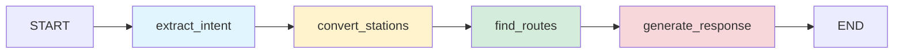

# 🚆 AI-Powered Indian Railway Route Planner

An intelligent train route planning system that uses **OpenAI's GPT-4** and **LangGraph** to find optimal railway routes across India.

## ✨ Features

- **🤖 AI-Powered Station Detection**: Automatically converts city names to railway station codes
- **🔄 Smart Route Finding**: Finds direct and connecting routes with up to 4 legs
- **⚡ Performance Optimized**: Caching layer and parallel API calls for faster results
- **🔒 Secure Configuration**: Environment variable-based configuration
- **📊 Intelligent Recommendations**: AI-powered route recommendations with detailed analysis
- **🎯 Fallback Mechanisms**: Suggests nearest alternative stations when direct routes aren't available
- **⏱ Layover Analysis**: Smart waiting time recommendations for connections

## 🚀 Quick Start

### Prerequisites

- Python 3.8 or higher
- OpenAI API key

### Installation

1. Clone the repository:
```bash
cd Train_Tracker/Langgraph
```

2. Install dependencies:
```bash
pip install -r requirements.txt
```

3. Create a `.env` file and add your OpenAI API key:
```
OPENAI_API_KEY=sk-your-actual-api-key-here
```

### Running the Application

1. Start the Flask backend server:
```bash
python main.py
```
The server will start on `http://localhost:5000`.

2. Start the frontend server:
```bash
python frontend_server.py
```
The frontend UI will be accessible at `http://localhost:3000`.

## 📡 API Endpoints

### 1. Home
```
GET /
```
Returns service information and available endpoints.

### 2. Health Check
```
GET /health
```
Returns service health status.

### 3. Smart Query (Main Endpoint)
```
POST /api/smart_query
Content-Type: application/json

{
  "query": "Find trains from Mumbai to Delhi"
}
```

### 4. Direct Routes
```
GET /api/direct_routes?from=Mumbai&to=Delhi
```

## 📊 Example Usage

### Using cURL

```bash
curl -X POST http://localhost:5000/api/smart_query \
  -H "Content-Type: application/json" \
  -d '{"query": "Find trains from Goa to Vaishno Devi"}'
```

### Using Python

```python
import requests

response = requests.post(
    "http://localhost:5000/api/smart_query",
    json={"query": "Find trains from Chennai to Bangalore"}
)

print(response.json())
```

## 🏗️ LangGraph Implementation

### Overview

This application uses **LangGraph** to orchestrate an intelligent multi-step workflow for processing railway queries. The graph-based approach provides a clear, maintainable structure for complex AI-powered operations.

### State Schema

The workflow uses a `TypedDict` called `AgentState` to maintain state across all nodes:

```python
class AgentState(TypedDict):
    query: str                      # Original user query
    intent: str                     # Extracted intent (e.g., "find_trains")
    extracted_params: Dict[str, Any] # Parsed parameters (from, to, etc.)
    api_results: Dict[str, Any]     # Results from railway API calls
    final_response: str             # Formatted final response
    errors: List[str]               # Error messages collected during processing
```

**State Management Benefits:**
- **Shared Context**: All nodes access and modify the same state dictionary
- **Error Accumulation**: Errors are collected without halting execution
- **Transparency**: Easy to inspect state at any point in the workflow
- **Type Safety**: TypedDict provides type hints for better IDE support

### Workflow Graph Structure



## Node Descriptions

### 1. **extract_intent_and_params** Node

**Purpose**: Parses the natural language query to extract intent and parameters using AI.

**Input**: 
- `state["query"]` - Raw user query (e.g., "Find trains from Mumbai to Delhi")

**Processing**:
1. Sends query to OpenAI with structured extraction prompt
2. Parses AI response as JSON
3. Extracts `intent` field (typically "find_trains")
4. Extracts `params` dict containing `from` and `to` locations

**Output**: 
- Updates `state["intent"]` with extracted intent
- Updates `state["extracted_params"]` with location parameters

**Error Handling**: 
- Falls back to default intent "find_trains" if AI parsing fails
- Initializes empty params dict on error

**Example Flow**:
```
Input Query: "Find trains from Guwahati to Bairabi"
    ↓
OpenAI Extraction
    ↓
Output: {
  "intent": "find_trains",
  "params": {"from": "Guwahati", "to": "Bairabi"}
}
```

**Code Location**: Lines 816-837 in `main.py`

---

### 2. **convert_locations_to_stations** Node

**Purpose**: Converts location names to official railway station codes with AI-powered validation.

**Input**: 
- `state["extracted_params"]["from"]` - Source location name
- `state["extracted_params"]["to"]` - Destination location name

**Processing**:
1. For each location, calls `find_nearest_station()` function
2. AI determines the correct railway station code
   - Handles informal names (e.g., "Mumbai" → "BCT" or "CSTM")
   - Handles pilgrimage sites (e.g., "Vaishno Devi" → "SVDK")
   - Handles misspellings and variations
3. Validates each station code with RailRadar API
4. If validation fails, tries AI-suggested nearest alternative stations
5. Stores station info including name, code, confidence, and alternatives

**Output**: 
- Adds `from_code`, `from_info` to `extracted_params`
- Adds `to_code`, `to_info` to `extracted_params`
- Appends errors to `state["errors"]` if station not found

**AI Capabilities**:
- **Knowledge-based Mapping**: Uses GPT's knowledge of Indian Railways
- **Nearest Station Suggestions**: Provides 2-3 alternatives with distances
- **Validation**: Cross-checks AI suggestions with live RailRadar API
- **Fallback Logic**: Automatically tries nearest stations if primary fails

**Example Flow**:
```
Input: {"from": "Vaishno Devi", "to": "Delhi"}
    ↓
AI Station Detection
    ↓
Output: {
  "from_code": "SVDK",
  "from_info": {
    "code": "SVDK",
    "name": "SHRI MATA VAISHNO DEVI KATRA",
    "confidence": "high",
    "nearest_stations": [
      {"code": "JAT", "name": "JAMMU TAWI", "distance": "20 km"}
    ],
    "explanation": "SVDK is the nearest railway station..."
  },
  "to_code": "NDLS",
  "to_info": {...}
}
```

**Code Location**: Lines 840-863 in `main.py`

---

### 3. **find_routes_node** Node

**Purpose**: Finds all available train routes between validated stations with intelligent fallbacks.

**Input**: 
- `state["extracted_params"]["from_code"]` - Source station code
- `state["extracted_params"]["to_code"]` - Destination station code
- Station info objects with alternative suggestions

**Processing**:
1. **Direct Route Search**: Queries RailRadar API for direct trains
2. **2-Leg Connection Search**: If no direct trains, tries routes via major junctions
3. **3-Leg Connection Search**: Escalates to 3-stop routes if needed
4. **4-Leg Connection Search**: Last resort for complex routes
5. **Alternative Station Search**: If no routes found, tries AI-suggested nearby stations
6. **Layover Validation**: Ensures waiting times are feasible (20 mins to 12 hours)
7. **Route Sorting**: Orders routes by fastest journey time

**Output**: 
- Stores `routes` array in `state["api_results"]`
- Includes `from_info` and `to_info` for response formatting

**Smart Features**:
- **Junction Prioritization**: Searches major hubs first (NDLS, HWH, MAS, etc.)
- **Layover Analysis**: Validates connection feasibility
- **Alternative Routing**: Uses AI-suggested nearby stations automatically
- **Performance**: Stops searching once sufficient routes found

**Example Flow**:
```
Input: {"from_code": "SVDK", "to_code": "BSB"}
    ↓
1. Check Direct Trains: None found
    ↓
2. Try 2-Leg via JAT: ✓ Found
   - SVDK → JAT (Train 12472) 
   - JAT → BSB (Train 12318)
   - Layover: 2h 30m (Comfortable)
    ↓
3. Try 2-Leg via NDLS: ✓ Found
   - SVDK → NDLS (Train 12426)
   - NDLS → BSB (Train 12560)
    ↓
Output: [Route via JAT (faster), Route via NDLS]
```

**Code Location**: Lines 866-888 in `main.py`

---

### 4. **generate_response** Node

**Purpose**: Formats all collected data into a user-friendly JSON response.

**Input**: 
- `state["api_results"]["routes"]` - Array of found routes
- `state["api_results"]["from_info"]` - Source station details
- `state["api_results"]["to_info"]` - Destination station details
- `state["errors"]` - Any accumulated errors

**Processing**:
1. **Error Check**: If errors exist, returns error response with suggestions
2. **Route Formatting**: 
   - **Direct Trains**: Shows simple departure/arrival info
   - **Connecting Routes**: Provides segment-by-segment breakdown
3. **Waiting Time Analysis**: Adds color-coded recommendations
   - 🔴 **TIGHT** (< 30 mins): Risk of missing connection
   - 🟠 **MODERATE** (30-60 mins): Manageable but rush needed
   - 🟢 **COMFORTABLE** (1-3 hours): Good buffer time
   - 🔵 **LONG** (> 3 hours): Time for refreshments/exploration
4. **AI Recommendation**: Generates explanation for why first option is best
5. **Alternative Notes**: Includes info if using nearby stations

**Output**: 
- Sets `state["final_response"]` with complete formatted response
- This is returned to the user via Flask endpoint

**Response Structure**:
```json
{
  "success": true,
  "journey": {
    "from": "SHRI MATA VAISHNO DEVI KATRA (SVDK)",
    "to": "VARANASI JUNCTION (BSB)",
    "totalOptions": 3
  },
  "aiRecommendation": {
    "recommendedOption": 1,
    "reason": "✅ Best Available: 2-train connection via JAT",
    "totalJourneyTime": "12h 45m",
    "highlights": [...]
  },
  "availableTrains": [
    {
      "option": 1,
      "type": "🔄 2-TRAIN CONNECTION",
      "trains": [...],
      "waitingTimes": [
        {
          "atStation": "JAT",
          "waitingTime": "2h 30m",
          "status": "✅ COMFORTABLE",
          "advice": "Good buffer time for connections"
        }
      ]
    }
  ]
}
```

**Code Location**: Lines 891-907 in `main.py`

---

## Edge Connections

The workflow follows a **sequential, linear pattern** where each node completes before the next begins:

```python
workflow.set_entry_point("extract_intent")              # Entry point
workflow.add_edge("extract_intent", "convert_stations")  # Step 1 → Step 2
workflow.add_edge("convert_stations", "find_routes")     # Step 2 → Step 3
workflow.add_edge("find_routes", "generate_response")    # Step 3 → Step 4
workflow.add_edge("generate_response", END)              # Step 4 → Exit
```

**Why Linear?**
- **Dependencies**: Each node requires output from the previous
- **Clarity**: Easy to understand and debug
- **Error Propagation**: Errors accumulate without branching complexity
- **Simplicity**: No conditional routing needed for this use case

**Code Location**: Lines 919-923 in `main.py`

---

## Complete Data Flow Example

Here's how data transforms through the entire graph:

```
┌─────────────────────────────────────────────────────────────┐
│ INITIAL STATE (User Request)                                │
├─────────────────────────────────────────────────────────────┤
│ query: "Find trains from Vaishno Devi to Varanasi"         │
│ intent: ""                                                  │
│ extracted_params: {}                                        │
│ api_results: {}                                             │
│ final_response: ""                                          │
│ errors: []                                                  │
└─────────────────────────────────────────────────────────────┘
                            ↓
┌─────────────────────────────────────────────────────────────┐
│ AFTER extract_intent NODE                                   │
├─────────────────────────────────────────────────────────────┤
│ query: "Find trains from Vaishno Devi to Varanasi"         │
│ intent: "find_trains"  ← ADDED                             │
│ extracted_params: {                                         │
│   "from": "Vaishno Devi",  ← ADDED                         │
│   "to": "Varanasi"  ← ADDED                                │
│ }                                                           │
│ api_results: {}                                             │
│ final_response: ""                                          │
│ errors: []                                                  │
└─────────────────────────────────────────────────────────────┘
                            ↓
┌─────────────────────────────────────────────────────────────┐
│ AFTER convert_stations NODE                                 │
├─────────────────────────────────────────────────────────────┤
│ query: "Find trains from Vaishno Devi to Varanasi"         │
│ intent: "find_trains"                                       │
│ extracted_params: {                                         │
│   "from": "Vaishno Devi",                                   │
│   "to": "Varanasi",                                         │
│   "from_code": "SVDK",  ← ADDED                            │
│   "from_info": {  ← ADDED                                  │
│     "code": "SVDK",                                         │
│     "name": "SHRI MATA VAISHNO DEVI KATRA",                │
│     "nearest_stations": [...]                              │
│   },                                                        │
│   "to_code": "BSB",  ← ADDED                               │
│   "to_info": {  ← ADDED                                    │
│     "code": "BSB",                                          │
│     "name": "VARANASI JUNCTION",                           │
│     "nearest_stations": [...]                              │
│   }                                                         │
│ }                                                           │
│ api_results: {}                                             │
│ final_response: ""                                          │
│ errors: []                                                  │
└─────────────────────────────────────────────────────────────┘
                            ↓
┌─────────────────────────────────────────────────────────────┐
│ AFTER find_routes NODE                                      │
├─────────────────────────────────────────────────────────────┤
│ [Previous state unchanged...]                               │
│ api_results: {  ← POPULATED                                │
│   "routes": [                                               │
│     {                                                       │
│       "type": "connecting",                                 │
│       "legs": 2,                                            │
│       "durationMins": 720,                                  │
│       "segments": [                                         │
│         {                                                   │
│           "trainNumber": "12472",                           │
│           "trainName": "SVDK JAT SF EXP",                   │
│           "from": "SVDK",                                   │
│           "to": "JAT",                                      │
│           "departure": "14:30",                             │
│           "arrival": "16:00"                                │
│         },                                                  │
│         {                                                   │
│           "trainNumber": "12318",                           │
│           "trainName": "AKAL TAKHT EXP",                    │
│           "from": "JAT",                                    │
│           "to": "BSB",                                      │
│           "departure": "18:30",                             │
│           "arrival": "10:30"                                │
│         }                                                   │
│       ],                                                    │
│       "layovers": [                                         │
│         {                                                   │
│           "station": "JAT",                                 │
│           "waitingMins": 150,                               │
│           "recommendation": {...}                           │
│         }                                                   │
│       ]                                                     │
│     }                                                       │
│   ],                                                        │
│   "from_info": {...},                                       │
│   "to_info": {...}                                          │
│ }                                                           │
│ errors: []                                                  │
└─────────────────────────────────────────────────────────────┘
                            ↓
┌─────────────────────────────────────────────────────────────┐
│ AFTER generate_response NODE (FINAL)                        │
├─────────────────────────────────────────────────────────────┤
│ [All previous state...]                                     │
│ final_response: {  ← FORMATTED RESPONSE                    │
│   "success": true,                                          │
│   "journey": {                                              │
│     "from": "SHRI MATA VAISHNO DEVI KATRA (SVDK)",         │
│     "to": "VARANASI JUNCTION (BSB)",                       │
│     "totalOptions": 1                                       │
│   },                                                        │
│   "aiRecommendation": {                                     │
│     "recommendedOption": 1,                                 │
│     "reason": "✅ Best Available: 2-train via JAT",        │
│     "totalJourneyTime": "12h 0m"                            │
│   },                                                        │
│   "availableTrains": [...]                                  │
│ }                                                           │
└─────────────────────────────────────────────────────────────┘
```

---

## Graph Compilation & Execution

### Graph Creation

The workflow graph is defined once and compiled at application startup:

```python
def create_agent_graph():
    # Initialize StateGraph with our state schema
    workflow = StateGraph(AgentState)
    
    # Add all 4 nodes
    workflow.add_node("extract_intent", extract_intent_and_params)
    workflow.add_node("convert_stations", convert_locations_to_stations)
    workflow.add_node("find_routes", find_routes_node)
    workflow.add_node("generate_response", generate_response)
    
    # Define sequential edges
    workflow.set_entry_point("extract_intent")
    workflow.add_edge("extract_intent", "convert_stations")
    workflow.add_edge("convert_stations", "find_routes")
    workflow.add_edge("find_routes", "generate_response")
    workflow.add_edge("generate_response", END)
    
    # Compile into executable graph
    return workflow.compile()

# Create singleton instance
agent_graph = create_agent_graph()
```

**Code Location**: Lines 911-925 in `main.py`

### Graph Execution

For each API request, the graph is invoked with fresh initial state:

```python
# In Flask /api/smart_query endpoint
initial_state = {
    "query": user_query,
    "intent": "",
    "extracted_params": {},
    "api_results": {},
    "final_response": "",
    "errors": []
}

# Execute the entire graph
result = agent_graph.invoke(initial_state)

# Extract final response
response = result["final_response"]
```

**Code Location**: Lines 979-991 in `main.py`

---

## Key Benefits of LangGraph Architecture

### 1. 🔄 **Clear State Management**
- All nodes share a common state dictionary
- Easy to track data transformations
- No hidden state or side effects

### 2. 📊 **Modularity & Maintainability**
- Each node has a single, well-defined responsibility
- Easy to test nodes independently
- Simple to add new nodes (e.g., fare calculation, seat availability)

### 3. 🛡️ **Robust Error Handling**
- Errors accumulate without stopping workflow
- Graceful degradation (e.g., try alternatives if primary fails)
- Clear error messages propagated to user

### 4. 🔧 **Easy Extensibility**
Potential future enhancements:
- Add conditional routing (e.g., if direct train found, skip junction search)
- Add parallel processing nodes (e.g., check multiple APIs simultaneously)
- Add human-in-the-loop approval (e.g., confirm station before searching)
- Add caching node (e.g., check cache before API calls)

### 5. 📝 **Debugging & Observability**
- Can inspect state at any point
- Clear execution flow
- Easy to add logging at node boundaries

### 6. ♻️ **Performance**
- Graph compiled once, reused for all requests
- No overhead per request
- Efficient state passing (by reference)

---

