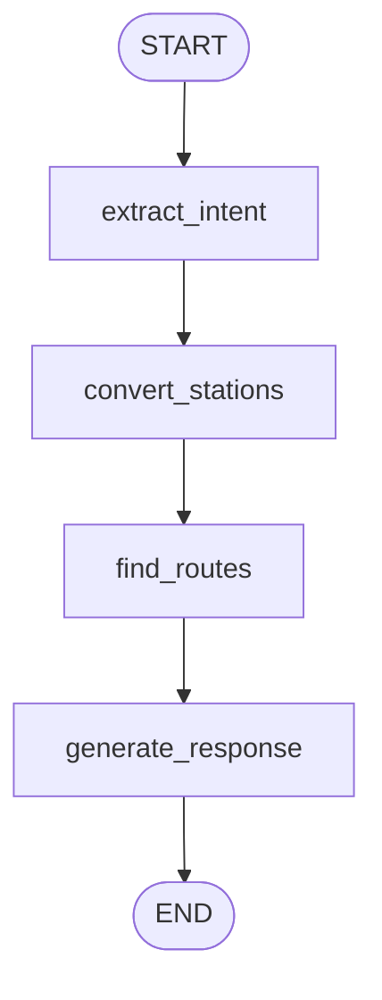

# 🚆 AI-Powered Indian Railway Route Planner

<p align="center">
  <b>Intelligent Train Route Planning using AI + LangGraph</b><br>
  Find optimal railway routes across India with natural language queries
</p>

<p align="center">
  
  
  
  
  
</p>

---

## 📌 Overview

**Train Tracker** is an AI-powered railway route planning system that understands **natural language queries** and provides:

- 🚄 Direct train routes  
- 🔄 Multi-leg journeys (up to 4 connections)  
- ⏱ Smart layover analysis  
- 🎯 AI-based route recommendations  

💡 Example query:  "Fastest train travel from Vaishno Devi to Bangalore"


---
## ✨ Features

- **🤖 AI-Powered Station Detection**: Automatically converts city names to railway station codes
- **🔄 Smart Route Finding**: Finds direct and connecting routes with up to 4 legs
- **⚡ Performance Optimized**: Caching layer and parallel API calls for faster results
- **🔒 Secure Configuration**: Environment variable-based configuration
- **📊 Intelligent Recommendations**: AI-powered route recommendations with detailed analysis
- **🎯 Fallback Mechanisms**: Suggests nearest alternative stations when direct routes aren't available
- **⏱ Layover Analysis**: Smart waiting time recommendations for connections
---

## 🛠️ Tech Stack

### 🔹 Backend
* **Python**
* **Flask** – REST API
* **LangGraph** – Workflow orchestration
* **OpenAI (GPT‑4o‑mini)** – NLP & reasoning
* **RailRadar API** – Live train data 

### 🔹 Frontend
- HTML5  
- CSS3  
- Vanilla JavaScript  

---

## 🧠 System Architecture

```text
User → Frontend → Flask API → LangGraph Workflow
                                  ↓
                        OpenAI + Railway APIs
                                  ↓
                            JSON Response
```

---

## 📁 Project Structure

```text
Train_Tracker/
├── Langgraph/
│   ├── main.py              # Core backend + LangGraph workflow
│   ├── frontend_server.py   # Frontend server (port 3000)
│   ├── config.py            # Configuration & environment
│   ├── .env                 # API keys (ignored in git)
│   ├── requirements.txt
│   └── static/
│       ├── index.html       # UI
│       ├── style.css        # Styling
│       └── script.js        # Frontend logic
```

---

## 🔗 LangGraph Workflow (Core Logic)




```
START
  ↓
extract_intent
  ↓
convert_stations
  ↓
find_routes
  ↓
generate_response
  ↓
END
```

Each node modifies a shared state object (`AgentState`).

---

## 🧩 Node‑by‑Node Explanation

### 🔹 `extract_intent`
- Uses AI to extract:
  - `intent`  
  - source (`from`)  
  - destination (`to`)  

---

### 🔹 `convert_stations`
- Converts names → station codes  
- Handles:
  - Cities  
  - Temples  
  - Misspellings  
- Validates via API  
- Suggests fallback stations  

---

### 🔹 `find_routes`
- Searches:
  1. Direct routes  
  2. 2-leg routes  
  3. 3-leg routes  
  4. 4-leg routes  
- Validates layovers (20 min – 12 hrs)

---

### 🔹 `generate_response`
- Formats output  
- Adds:
  - Route summary  
  - Layover insights  
  - AI recommendation  

---

## 📦 State Management (`AgentState`)

```python
class AgentState(TypedDict):
    query: str
    intent: str
    extracted_params: Dict[str, Any]
    api_results: Dict[str, Any]
    final_response: str
    errors: List[str]
```

**Benefits:**
- Shared memory across nodes
- Easy debugging
- Transparent workflow
- Deterministic execution

---

##  🚦 Route & Leg Logic

### What is a Leg?
**1 Leg = One train journey**

### Examples:
- **Direct** → A → B
- **2 Legs** → A → X → B
- **3 Legs** → A → X → Y → B

### Key Logic:
- Uses major junctions (NDLS, BCT, HWH, SBC, MAS)
- Checks:
  - Train availability
  - Layover feasibility
  - Travel duration
---

## Edge Connections

The workflow follows a **sequential, linear pattern** where each node completes before the next begins:

```python
workflow.set_entry_point("extract_intent")              # Entry point
workflow.add_edge("extract_intent", "convert_stations")  # Step 1 → Step 2
workflow.add_edge("convert_stations", "find_routes")     # Step 2 → Step 3
workflow.add_edge("find_routes", "generate_response")    # Step 3 → Step 4
workflow.add_edge("generate_response", END)              # Step 4 → Exit
```

**Why Linear?**
- **Dependencies**: Each node requires output from the previous
- **Clarity**: Easy to understand and debug
- **Error Propagation**: Errors accumulate without branching complexity
- **Simplicity**: No conditional routing needed for this use case

**Code Location**: Lines 919-923 in `main.py`

---

## Complete Data Flow Example

Here's how data transforms through the entire graph:

```
┌─────────────────────────────────────────────────────────────┐
│ INITIAL STATE (User Request)                                │
├─────────────────────────────────────────────────────────────┤
│ query: "Find trains from Vaishno Devi to Varanasi"         │
│ intent: ""                                                  │
│ extracted_params: {}                                        │
│ api_results: {}                                             │
│ final_response: ""                                          │
│ errors: []                                                  │
└─────────────────────────────────────────────────────────────┘
                            ↓
┌─────────────────────────────────────────────────────────────┐
│ AFTER extract_intent NODE                                   │
├─────────────────────────────────────────────────────────────┤
│ query: "Find trains from Vaishno Devi to Varanasi"         │
│ intent: "find_trains"  ← ADDED                             │
│ extracted_params: {                                         │
│   "from": "Vaishno Devi",  ← ADDED                         │
│   "to": "Varanasi"  ← ADDED                                │
│ }                                                           │
│ api_results: {}                                             │
│ final_response: ""                                          │
│ errors: []                                                  │
└─────────────────────────────────────────────────────────────┘
                            ↓
┌─────────────────────────────────────────────────────────────┐
│ AFTER convert_stations NODE                                 │
├─────────────────────────────────────────────────────────────┤
│ query: "Find trains from Vaishno Devi to Varanasi"         │
│ intent: "find_trains"                                       │
│ extracted_params: {                                         │
│   "from": "Vaishno Devi",                                   │
│   "to": "Varanasi",                                         │
│   "from_code": "SVDK",  ← ADDED                            │
│   "from_info": {  ← ADDED                                  │
│     "code": "SVDK",                                         │
│     "name": "SHRI MATA VAISHNO DEVI KATRA",                │
│     "nearest_stations": [...]                              │
│   },                                                        │
│   "to_code": "BSB",  ← ADDED                               │
│   "to_info": {  ← ADDED                                    │
│     "code": "BSB",                                          │
│     "name": "VARANASI JUNCTION",                           │
│     "nearest_stations": [...]                              │
│   }                                                         │
│ }                                                           │
│ api_results: {}                                             │
│ final_response: ""                                          │
│ errors: []                                                  │
└─────────────────────────────────────────────────────────────┘
                            ↓
┌─────────────────────────────────────────────────────────────┐
│ AFTER find_routes NODE                                      │
├─────────────────────────────────────────────────────────────┤
│ [Previous state unchanged...]                               │
│ api_results: {  ← POPULATED                                │
│   "routes": [                                               │
│     {                                                       │
│       "type": "connecting",                                 │
│       "legs": 2,                                            │
│       "durationMins": 720,                                  │
│       "segments": [                                         │
│         {                                                   │
│           "trainNumber": "12472",                           │
│           "trainName": "SVDK JAT SF EXP",                   │
│           "from": "SVDK",                                   │
│           "to": "JAT",                                      │
│           "departure": "14:30",                             │
│           "arrival": "16:00"                                │
│         },                                                  │
│         {                                                   │
│           "trainNumber": "12318",                           │
│           "trainName": "AKAL TAKHT EXP",                    │
│           "from": "JAT",                                    │
│           "to": "BSB",                                      │
│           "departure": "18:30",                             │
│           "arrival": "10:30"                                │
│         }                                                   │
│       ],                                                    │
│       "layovers": [                                         │
│         {                                                   │
│           "station": "JAT",                                 │
│           "waitingMins": 150,                               │
│           "recommendation": {...}                           │
│         }                                                   │
│       ]                                                     │
│     }                                                       │
│   ],                                                        │
│   "from_info": {...},                                       │
│   "to_info": {...}                                          │
│ }                                                           │
│ errors: []                                                  │
└─────────────────────────────────────────────────────────────┘
                            ↓
┌─────────────────────────────────────────────────────────────┐
│ AFTER generate_response NODE (FINAL)                        │
├─────────────────────────────────────────────────────────────┤
│ [All previous state...]                                     │
│ final_response: {  ← FORMATTED RESPONSE                    │
│   "success": true,                                          │
│   "journey": {                                              │
│     "from": "SHRI MATA VAISHNO DEVI KATRA (SVDK)",         │
│     "to": "VARANASI JUNCTION (BSB)",                       │
│     "totalOptions": 1                                       │
│   },                                                        │
│   "aiRecommendation": {                                     │
│     "recommendedOption": 1,                                 │
│     "reason": "✅ Best Available: 2-train via JAT",        │
│     "totalJourneyTime": "12h 0m"                            │
│   },                                                        │
│   "availableTrains": [...]                                  │
│ }                                                           │
└─────────────────────────────────────────────────────────────┘
```
---

##  📡 API Endpoints

### 🔹 Smart Query
`POST /api/smart_query`
```json
{
  "query": "Find trains from Delhi to Goa"
}
```

### 🔹 Health Check
`GET /health`

---

## 🔁 Frontend ↔ Backend Flow

1. User enters query
2. JS sends POST request
3. Flask receives request
4. LangGraph executes workflow
5. APIs + AI process data
6. JSON response returned
7. UI renders results

---

##  🔍 End-to-End Example

**Query:**
*"Help me reach Vaishno Devi from Bangalore"*

**Flow:**
- **Extract** → Bangalore → Vaishno Devi
- **Convert** → SBC → SVDK
- **Route** → via NDLS
- **Layover** → 4 hours
- **Output** → Best route recommendation

---

##  ⚡ Performance Considerations

- **Model:** GPT-4o-mini (fast + cost-efficient)
- **Optimization:** Early stopping after enough routes are found
- **Search Strategy:** Junction prioritization
- **Response Time:**
  - Direct routes → 1–2 sec
  - Multi-leg routes → 10–30 sec

---

##  ⚙️ Setup & Installation

```bash
pip install -r requirements.txt
```

Create a `.env` file in the root directory:

```env
OPENAI_API_KEY=your_api_key_here
```

---

##  ▶️ Running the Project

**1. Start Backend:**
```bash
python main.py
```
*Backend URL:* `http://localhost:5000`

**2. Start Frontend:**
```bash
python frontend_server.py
```
*Frontend URL:* `http://localhost:3000`

---

##  📊 Example Usage

### cURL
```bash
curl -X POST http://localhost:5000/api/smart_query \
-H "Content-Type: application/json" \
-d '{"query": "Find trains from Goa to Delhi"}'
```

### Python
```python
import requests

response = requests.post(
    "http://localhost:5000/api/smart_query",
    json={"query": "Find trains from Chennai to Bangalore"}
)

print(response.json())
```

---
