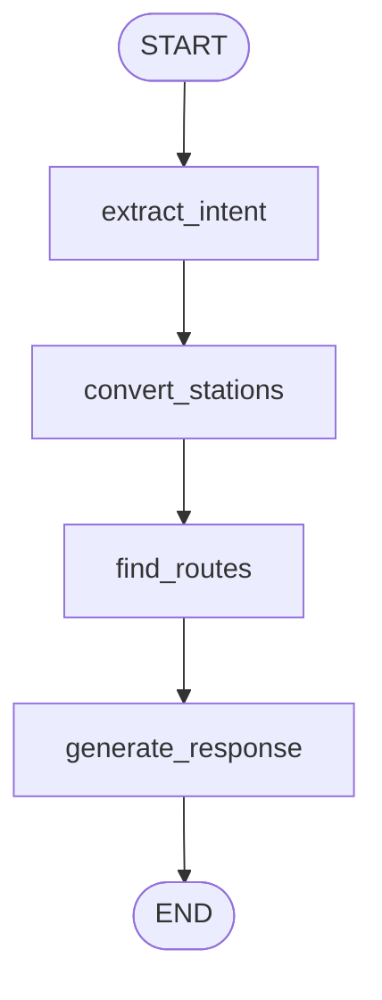

# 🚆 AI-Powered Indian Railway Route Planner (Train Tracker)

An intelligent **AI-based railway route planning system** that understands natural language queries and provides **optimal train routes across India**, including **direct and multi-leg journeys (up to 4 legs)** with **smart recommendations and layover analysis**.

---

## 📌 Table of Contents

1. [Project Overview](#1️⃣-project-overview)
2. [Key Objectives](#2️⃣-key-objectives)
3. [Features](#3️⃣--features)
4. [Tech Stack](#4️⃣--tech-stack)
5. [System Architecture](#5️⃣--system-architecture)
6. [Project Structure](#6️⃣--project-structure)
7. [LangGraph Workflow](#7️⃣--langgraph-workflow-core-logic)
8. [Node-wise Explanation](#8️⃣--node-wise-explanation)
9. [State Management](#9️⃣--state-management-agentstate)
10. [Route & Leg Logic](#🔟--route--leg-logic)
11. [API Endpoints](#1️⃣1️⃣--api-endpoints)
12. [Frontend–Backend Interaction](#1️⃣2️⃣--frontend--backend-flow)
13. [End-to-End Flow](#1️⃣3️⃣--end-to-end-example)
14. [Performance Considerations](#1️⃣4️⃣--performance-considerations)
15. [Setup & Installation](#1️⃣5️⃣-️-setup--installation)
16. [Running the Project](#1️⃣6️⃣-️-running-the-project)
17. [Example Usage](#1️⃣7️⃣--example-usage)
18. [Future Enhancements](#1️⃣8️⃣--future-enhancements)
19. [License](#1️⃣9️⃣--license)

---

## 1️⃣ Project Overview

**Train Tracker** is an AI-powered application designed to simplify Indian Railway travel planning.

Instead of requiring users to know exact **station codes**, the system allows queries like:

> *"Help me travel from Vaishno Devi to Bangalore"*

The system intelligently:

- Extracts intent using AI  
- Converts locations into station codes  
- Finds direct or connecting routes  
- Evaluates layovers  
- Recommends the best journey  

---

## 2️⃣ Key Objectives

- Remove dependency on railway station codes  
- Support complex journeys (multi-leg routes)  
- Demonstrate **LangGraph-based AI workflows**  
- Build a **production-style AI system architecture**  

---

## 3️⃣ ✨ Features

- 🤖 **AI-based intent extraction** (natural language → structured data)  
- 🚉 **Smart station resolution** (cities, temples, aliases)  
- 🔄 **Multi-leg route planning** (up to 4 legs)  
- ⏱️ **Layover feasibility analysis**  
- 🎯 **AI-powered recommendations**  
- 🔁 **Nearby station fallback mechanism**  
- ⚡ **Optimized API calls & early stopping**  
- 🔒 **Secure environment-based configuration**  

---

## 4️⃣ 🛠️ Tech Stack

### Backend
- **Python**  
- **Flask** (REST API)  
- **LangGraph** (workflow orchestration)  
- **OpenAI** (GPT-4o-mini)  
- **RailRadar API**  

### Frontend
- **HTML5**  
- **CSS3**  
- **Vanilla JavaScript**  

---

## 5️⃣ 🧠 System Architecture

```text
User → Frontend → Flask API → LangGraph Workflow
                                  ↓
                        OpenAI + Railway APIs
                                  ↓
                            JSON Response
```

---

## 6️⃣ 📁 Project Structure

```text
Train_Tracker/
├── Langgraph/
│   ├── main.py              # Core backend + LangGraph workflow
│   ├── frontend_server.py   # Frontend server (port 3000)
│   ├── config.py            # Configuration & environment
│   ├── .env                 # API keys (ignored in git)
│   ├── requirements.txt
│   └── static/
│       ├── index.html       # UI
│       ├── style.css        # Styling
│       └── script.js        # Frontend logic
```

---

## 7️⃣ 🔗 LangGraph Workflow (Core Logic)



---

## 8️⃣ 🧩 Node-wise Explanation

### 🔹 `extract_intent`
- Uses AI to extract:
  - `intent`  
  - source (`from`)  
  - destination (`to`)  

---

### 🔹 `convert_stations`
- Converts names → station codes  
- Handles:
  - Cities  
  - Temples  
  - Misspellings  
- Validates via API  
- Suggests fallback stations  

---

### 🔹 `find_routes`
- Searches:
  1. Direct routes  
  2. 2-leg routes  
  3. 3-leg routes  
  4. 4-leg routes  
- Validates layovers (20 min – 12 hrs)

---

### 🔹 `generate_response`
- Formats output  
- Adds:
  - Route summary  
  - Layover insights  
  - AI recommendation  

---

## 9️⃣ 📦 State Management (`AgentState`)

```python
class AgentState(TypedDict):
    query: str
    intent: str
    extracted_params: Dict[str, Any]
    api_results: Dict[str, Any]
    final_response: str
    errors: List[str]
```

**Benefits:**
- Shared memory across nodes
- Easy debugging
- Transparent workflow
- Deterministic execution

---

## 🔟 🚦 Route & Leg Logic

### What is a Leg?
**1 Leg = One train journey**

### Examples:
- **Direct** → A → B
- **2 Legs** → A → X → B
- **3 Legs** → A → X → Y → B

### Key Logic:
- Uses major junctions (NDLS, BCT, HWH, SBC, MAS)
- Checks:
  - Train availability
  - Layover feasibility
  - Travel duration

---

## 1️⃣1️⃣ 📡 API Endpoints

### 🔹 Smart Query
`POST /api/smart_query`
```json
{
  "query": "Find trains from Delhi to Goa"
}
```

### 🔹 Health Check
`GET /health`

---

## 1️⃣2️⃣ 🔁 Frontend ↔ Backend Flow

1. User enters query
2. JS sends POST request
3. Flask receives request
4. LangGraph executes workflow
5. APIs + AI process data
6. JSON response returned
7. UI renders results

---

## 1️⃣3️⃣ 🔍 End-to-End Example

**Query:**
*"Help me reach Vaishno Devi from Bangalore"*

**Flow:**
- **Extract** → Bangalore → Vaishno Devi
- **Convert** → SBC → SVDK
- **Route** → via NDLS
- **Layover** → 4 hours
- **Output** → Best route recommendation

---

## 1️⃣4️⃣ ⚡ Performance Considerations

- **Model:** GPT-4o-mini (fast + cost-efficient)
- **Optimization:** Early stopping after enough routes are found
- **Search Strategy:** Junction prioritization
- **Response Time:**
  - Direct routes → 1–2 sec
  - Multi-leg routes → 10–30 sec

---

## 1️⃣5️⃣ ⚙️ Setup & Installation

```bash
pip install -r requirements.txt
```

Create a `.env` file in the root directory:

```env
OPENAI_API_KEY=your_api_key_here
```

---

## 1️⃣6️⃣ ▶️ Running the Project

**1. Start Backend:**
```bash
python main.py
```
*Backend URL:* `http://localhost:5000`

**2. Start Frontend:**
```bash
python frontend_server.py
```
*Frontend URL:* `http://localhost:3000`

---

## 1️⃣7️⃣ 📊 Example Usage

### cURL
```bash
curl -X POST http://localhost:5000/api/smart_query \
-H "Content-Type: application/json" \
-d '{"query": "Find trains from Goa to Delhi"}'
```

### Python
```python
import requests

response = requests.post(
    "http://localhost:5000/api/smart_query",
    json={"query": "Find trains from Chennai to Bangalore"}
)

print(response.json())
```

---
